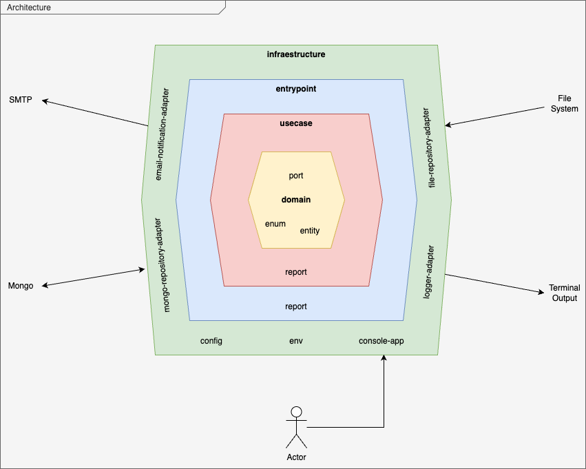

# Description
- This project allows you to send an account's transaction report by email, processing input data from .csv files, and has build with Go & Architecture Hexagonal

## Architecture 


## Pre-requisite
  - [Git](https://git-scm.com/book/en/v2/Getting-Started-Installing-Git)
  - [Docker](https://docs.docker.com/manuals/) 
  - [Docker Compose](https://docs.docker.com/manuals/) 

## Principal application folder structure

- domain: Contains all the abstract business code. IMPORTANT: the domain content has no outward dependency: not on frameworks, not on use case or infrastructure packages

- usecases: Is like a conductor, contains all business logic code. It will depend only on domain package to execute business logic. the usecases should
  not have any dependencies on infrastructure

- Application: Contains all the technical details, configuration, implementations (database, api, console, etc), and must not contain any business logic. Application has dependencies on domain, controller(usecase) and
  frameworks

- adapter: contains all the technical implementation of ports and internal frameworks, and must not contain any business logic

- config: containes all configuration to specific application(console, api, etc)

- entrypoint: contains the specific entrypoint or controller to usecases. IMPORTANT: the entrypoint layer, should be the only one layer to call direct the usecase layer

- env: contains all enviroment variables

- .resources: contains all external resources

- .docker: contains docker files to run locally

## Imput data definition
- .resources/account.csv: this file contains the account owner's details and you can change the email for yours.
    |Id       |Name   |Email  |
    | :---:   | :---: | :---: |
- .resources/transactions.csv: this file contains all transaction data
    |Id       |Date   |Transaction  |
    | :---:   | :---: | :---:       |
## Run application

```bash
$ docker-compose -f .docker/docker-compose.yml up -d
```

## To waths local DB

- [Url](http://0.0.0.0:8081/)
- User: root
- Pass: root
- DB: account_report_db
